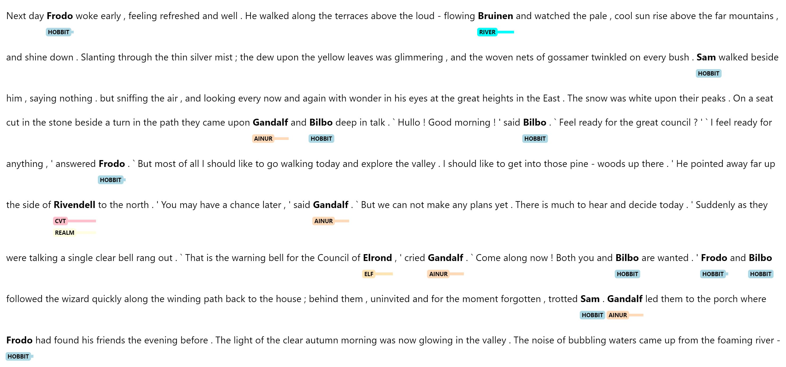

[](https://pypi.org/project/en-hobbit/)


# 🪐 spaCy Project: Hobbit spaCy


Welcome to Hobbit spaCy, a custom Natural Language Processing pipeline built on top of the powerful [spaCy](https://spacy.io/) library. This pipeline is designed specifically for working with Middle Earth data, providing custom NER, tokenization, and other NLP tasks specifically tailored for texts from the world of J.R.R. Tolkien.

This is a work-in-progress that is currently being built as a teaching lesson at the  TAP Institute's Summer 2023 spaCy series.

## Features

* SpanRuler
* merge_spans (Custom Component): identifies overlapping spans that share the same label and merges them into a single span. For example Bilbo (Hobbit) Baggins (Hobbit) becomes Bilbo Baggins (Hobbit)
* identify_relations (Custom Component): identifies constructions such as Frodo son of Drogo

### Entities

#### People
* MAN
* HOBBIT
* DWARF
* ELF
* AINUR

#### Places
* CVT (City, Village, Town) -- this includes Bag End
* REALM -- Sometimes places fall under both CVT and Realm, such as Rivendell
* MOUNTAIN
* ROAD

#### Other
* WEAPON

### SpanRuler Labels

* RELATION (e.g. Frodo son of Drogo)

## Forthcoming Features

* Custom NER trained on Middle Earth Data

## Installation

You can install the Hobbit spaCy via pip:

```shell
pip install en-hobbit
```

## Usage

Here's a quick example of how to use Hobbit spaCy:

```
import spacy
from spacy import displacy

nlp = spacy.load("en_hobbit")

with open("texts/council.txt", "r") as f:
    text = f.read()
doc = nlp(text)
colors = {
    'HOBBIT': "#ADD8E6",   # Light blue
    'CVT': "#FFC0CB",   # Pink
    'REALM': "#FFFFE0",    # Light yellow
    'MAN': "#E6E6FA",      # Lavender
    'DWARF': "#98FB98",    # Pale green
    'ELF': "#FFE4B5",      # Moccasin
    'AINUR': "#FFDAB9",     # Peachpuff
    'RIVER': "#00FFFF",     # Aqua
    'MOUNTAIN': "#8B4513",  # SaddleBrown
    'ROAD': "#808080",      # Gray
    'RELATION': "#800080"   # Purple
}

options = {"ents": ['HOBBIT', 'CVT', 'REALM', 'MAN', 'DWARF', 'ELF', 'AINUR', "RIVER", "MOUNTAIN", "ROAD", "RELATION"], "colors": colors}
options["spans_key"] = "main"
displacy.render(doc, style="span", options=options)
```

Expected Output:



### 🗂 Assets

The following assets are defined by the project. They can
be fetched by running [`spacy project assets`](https://spacy.io/api/cli#project-assets)
in the project directory.

| File | Source | Description |
| --- | --- | --- |
| [`assets/train.json`](assets/cities.csv) | Local | Collection of Cities, Villages, and Towns (CVT) |
| [`assets/dev.json`](assets/fps.txt) | Local | Collection of False Positives to Remove when Creating the Pipeline (i.e IV or I as a person) |
| [`assets/train.json`](assets/mountain.txt) | Local | List of Mountains |
| [`assets/train.json`](assets/names.csv) | Local | List of extra names to augment the online dataset |
| [`assets/train.json`](assets/realm.txt) | List of realms in Middle Earth |
| [`assets/train.json`](assets/river.txt) | Local | List of rivers in Middle Earth |
| [`assets/train.json`](assets/road.txt) | Local | List of roads in Middle Earth |
| [`assets/train.json`](assets/shire.csv) | Local | List of places connected to the Shire (CVT tag) |

## License

Hobbit spaCy is released under the [MIT License](LICENSE).

## Contact

## Data Source

Source for the people can be found [here](https://github.com/juandes/lotr-names-classification)