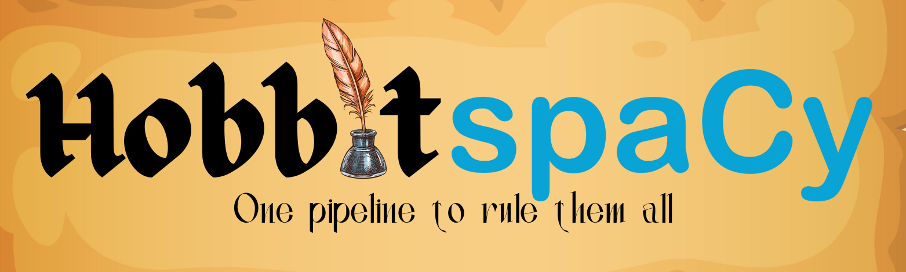
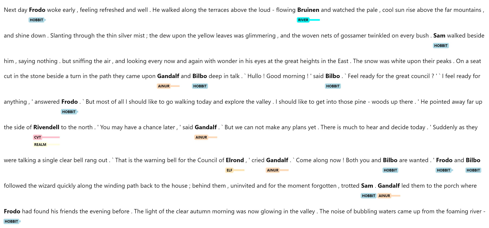

# Hobbit spaCy: A spaCy Pipeline for Middle Earth Data



Welcome to Hobbit spaCy, a custom Natural Language Processing pipeline built on top of the powerful [spaCy](https://spacy.io/) library. This pipeline is designed specifically for working with Middle Earth data, providing custom NER, tokenization, and other NLP tasks specifically tailored for texts from the world of J.R.R. Tolkien.

This is a work-in-progress that is currently being built as a teaching lesson at the  TAP Institute's Summer 2023 spaCy series.

## Features

* EntityRuler
* SpanRuler

### Entities

* REALM
* MAN
* HOBBIT
* DWARF
* ELF
* AINUR

### SpanRuler Labels

* RELATION (e.g. Frodo son of Drogo)

## Forthcoming Features

* Custom NER trained on Middle Earth Data

## Installation

You can install the Hobbit spaCy via pip:

```shell
pip install en-hobbit
```

## Usage

Here's a quick example of how to use Hobbit spaCy:

```
nlp = spacy.load("en_hobbit")
doc = nlp(text)
colors = {
    'HOBBIT': "#ADD8E6",   # Light blue
    'WIZARD': "#FFC0CB",   # Pink
    'REALM': "#FFFFE0",    # Light yellow
    'MAN': "#E6E6FA",      # Lavender
    'DWARF': "#98FB98",    # Pale green
    'ELF': "#FFE4B5",      # Moccasin
    'AINUR': "#FFDAB9"     # Peachpuff
}

options = {"ents": ['HOBBIT', 'WIZARD', 'REALM', 'MAN', 'DWARF', 'ELF', 'AINUR'], "colors": colors}
print(doc.spans["ruler"])
displacy.render(doc, style="ent", options=options)
```

Expected Output:



## Documentation


## Contributing

We welcome contributions!

## License

Hobbit spaCy is released under the [MIT License](LICENSE).

## Contact

## Data Source

Source for the people can be found [here](https://github.com/juandes/lotr-names-classification)